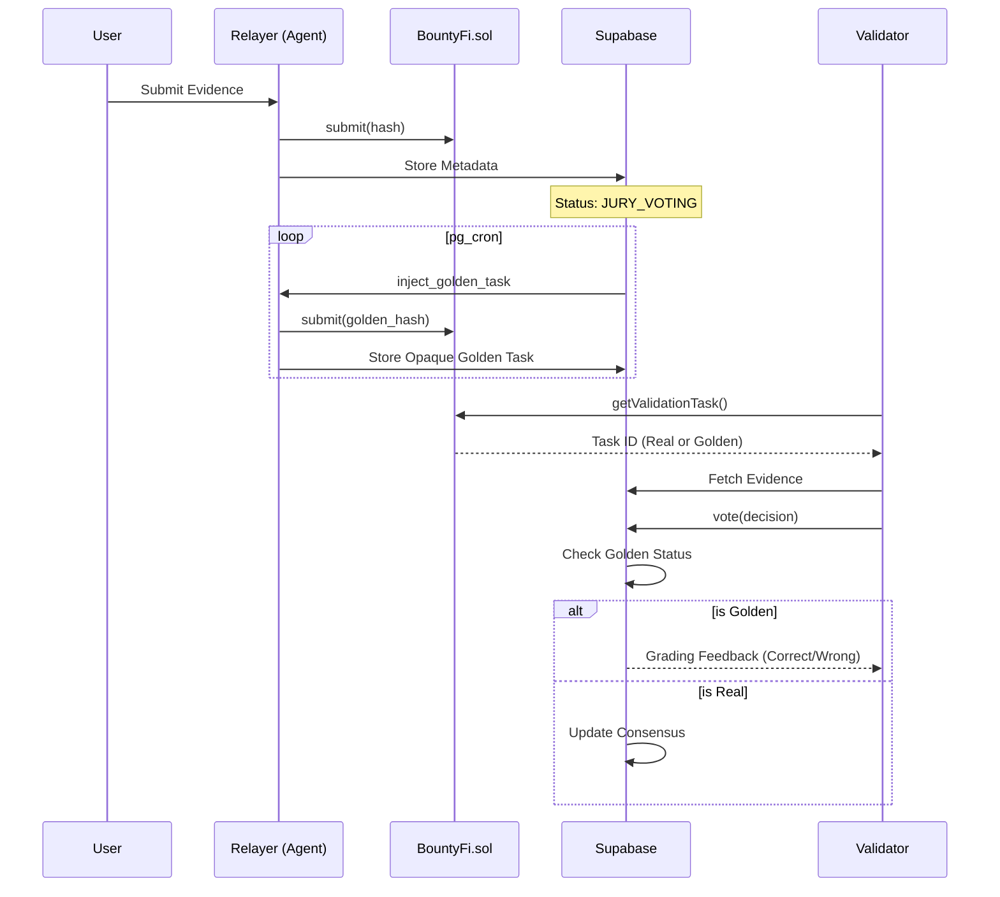

# Opaque Submission & Verification System

This document outlines the architecture and logic of BountyFi's submission and verification system, focusing on privacy, collusion prevention, and the "Golden Task" quality control mechanism.

## 1. Submission Flow (Opaque Commitment)

To prevent front-running and peeking, submissions use an opaque commitment pattern.

1.  **Client-Side**: The user captures evidence (photos, GPS).
2.  **Relayer (Edge Function)**:
    - Receives evidence.
    - Generates a `submissionHash` (opaque commitment).
    - Calls `submit(campaignId, submissionHash)` on the [BountyFi.sol](file:///Users/fabo/Desktop/Development/BountyFi/packages/contracts/src/BountyFi.sol) contract.
    - Stores full metadata (URLs, GPS) in the Supabase `submissions` table.
3.  **On-Chain State**: The contract only knows the submitter, the campaign, and the hash.

## 2. Verification & Jury System

Submissions are verified through a multi-tier process:

-   **AI Phase**: An oracle (Edge Function) evaluates the submission.
    -   **High Confidence**: Automatically `APPROVED`.
    -   **Low Confidence**: Automatically `REJECTED`.
    -   **Edge Cases**: Moved to `JURY_VOTING` status.
-   **Jury Phase (Human Review)**:
    -   Validators (other users) review the evidence via the **Validate** screen.
    -   Consensus (e.g., 2/3 majority) is required to finalize the decision.

## 3. Anti-Collusion Mechanisms

The system employs multiple layers to prevent users from validating their own or their friends' tasks:

-   **Self-Voting**: Prevented at both the Smart Contract ([BountyFi.sol:L193](file:///Users/fabo/Desktop/Development/BountyFi/packages/contracts/src/BountyFi.sol#L193)) and API levels.
-   **Close Network Filtering**: The `getValidationTask` function filters out submissions from:
    -   Trust Network connections (Truster/Trustee).
    -   Referral links (Referrer/Referred).
-   **Random Assignment**: Tasks are assigned pseudo-randomly to prevent targeted voting.
-   **Daily Limits**: Each validator is limited to 10 tasks per day ([BountyFi.sol:L175](file:///Users/fabo/Desktop/Development/BountyFi/packages/contracts/src/BountyFi.sol#L175)).

## 4. Golden Task System (Quality Control)

Golden tasks are synthetic tasks injected into the system to test validator honesty and accuracy.

### Injection
The `inject_golden_task` Edge Function (scheduled via `pg_cron`) randomly generates:
-   **Valid Tasks**: Correct photo/location, expected to be `APPROVED`.
-   **Invalid Tasks**: intentionally flawed (e.g., wrong object, same photo twice), expected to be `REJECTED`.

### Opaque Metadata
Golden tasks are indistinguishable from real tasks in the `submissions` table. Their "golden" status and "expected outcome" are stored in a private `golden_tasks` table, accessible only by the service role.

### Grading & Feedback
When a validator votes on a golden task:
1.  **Immediate Evaluation**: The `process_vote` function checks the private table.
2.  **Rewards**: Correct votes earn **Trust Diamonds** 💎.
3.  **Penalties**: Incorrect votes trigger a "Spot Check" warning. Repeated failures can lead to trust score degradation or network-wide penalties (e.g., losing tickets).

## 5. Summary Diagram

